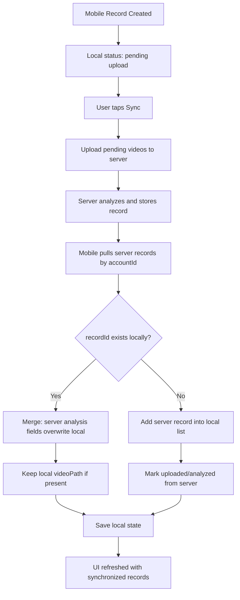

# Home Nystagmus Monitor - AGENTS

## Project Intent
- Build an Android app for home monitoring of possible nystagmus.
- App collects session records and uploads them to a remote server.
- Current phase goal: maintain a stable, product-oriented mobile workflow and continue hardening.

## Current Phase Scope
- Productized capture, record, and settings workflow
- Stable app architecture and package structure
- Account login persistence and account-scoped data flow
- Camera + ONNX analysis pipeline integration
- Production hardening roadmap (storage, upload reliability, quality controls)

## Rules (Vibe Coding)
- Keep each step small, runnable, and verifiable.
- Prefer simple architecture over premature abstractions.
- Keep algorithm entry points stable so later replacement is cheap.
- Use clear state-driven UI and avoid hidden side effects.
- Use English identifiers in code; product copy can be Chinese.

## Memory
- Platform: Android (Kotlin + Jetpack Compose)
- Environment: Android Studio + OpenJDK available
- Algorithm: integrated baseline implementation with ongoing optimization
- Primary objective now: "reliability, clarity, and production readiness"

## Milestones
1. Project setup and first runnable screen
2. Session workflow and local record list
3. Detection module and real-time camera pipeline
4. Account persistence and product copy refinement
5. Add persistence, upload robustness, permissions, and production hardening

## Next When User Asks
- Add Room/DataStore persistence for full local continuity
- Add auth + signed upload + retry policy
- Add patient workflow and clinical export format
- Add real-time signal curve and quality gate

## Data Management Policy (Mobile + Server)
- Source of truth is split by responsibility:
  - Mobile: capture state, local usability, pending upload queue, local video path.
  - Server: analysis result, long-term record storage, dashboard management.
- Sync mode is incremental (not full mirror overwrite).
- Upload action means "sync":
  - Mobile uploads pending local videos first.
  - Then mobile pulls server records for same account and merges by `recordId`.
- Merge rules:
  - If `recordId` exists on both sides, server analysis fields overwrite local analysis fields.
  - Local-only records are kept (do not force delete on client).
  - Server-only records are allowed to flow back to client (for previously uploaded history continuity).
  - Keep local `videoPath` when available (server path is not directly reusable on device).
- "Unable to analyze" is still a valid analysis result:
  - Must be persisted as analyzed with explicit summary message.
  - Must not remain in "pending analysis" state forever.
- Dashboard operation policy:
  - Dashboard uses archive semantics (not hard-delete business record).
  - Archived records are hidden from default lists/API responses.
  - Associated uploaded video file is cleaned up to save disk usage.

## Data Sync Flow (Mermaid)

## Doctor-Side Extension Notes
- Reuse same `recordId` and account-scoped sync semantics for doctor web/desktop client.
- Keep archive workflow as metadata state transition, not destructive deletion.
- Doctor-side should consume server records API as canonical analysis output.
