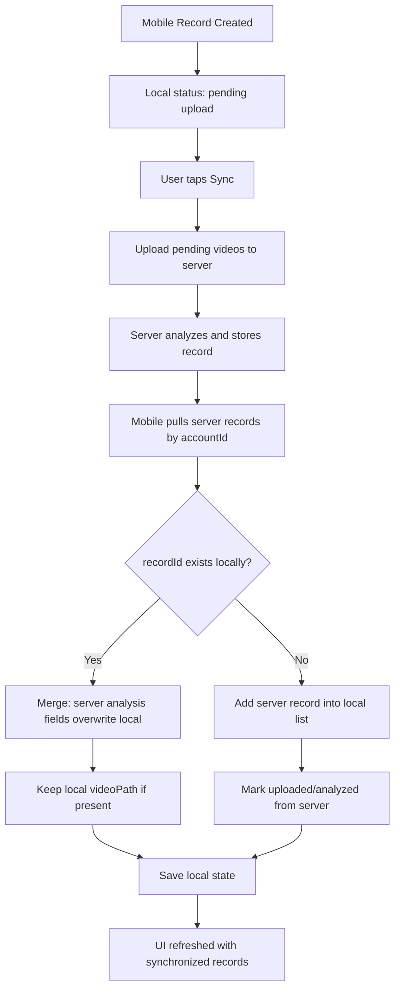

# Home Nystagmus Monitor - AGENTS

## Project Intent
- Build home monitoring tools for possible nystagmus.
- Android app collects session records and uploads them to a remote server.
- iPhone prototype demonstrates the device workflow with capture/import and a polished analysis dashboard.
- Current phase goal: maintain stable mobile workflows and continue hardening.

## Current Phase Scope
- Android productized capture, record, and settings workflow
- iPhone prototype capture/import-to-dashboard workflow
- Stable app architecture and package structure
- Account login persistence and account-scoped data flow
- Camera + ONNX analysis pipeline integration
- Production hardening roadmap (storage, upload reliability, quality controls)

## Rules (Vibe Coding)
- Keep each step small, runnable, and verifiable.
- Prefer simple architecture over premature abstractions.
- Keep algorithm entry points stable so later replacement is cheap.
- Use clear state-driven UI and avoid hidden side effects.
- Use English identifiers in code; product copy can be Chinese.

## Memory
- Platforms:
  - Android: Kotlin + Jetpack Compose in `android-app/`
  - iPhone prototype: SwiftUI in `iphone-app/`
- Environment: Android Studio + OpenJDK available; Xcode available for iPhone prototype
- Algorithm: integrated baseline implementation with ongoing optimization
- Primary objective now: "reliability, clarity, and production readiness"
- iPhone prototype currently has no database. The ONNX asset is bundled, but prototype dashboard analysis still uses a replaceable local Swift analysis service rather than real ONNX inference.
- iPhone prototype capture supports fixed back lens choices (`0.5`, `1`, `2`, `5`), tap/keyboard start-stop, and iPhone 16-series Camera Control via `AVCaptureEventInteraction`.
- iPhone dashboard is now evidence-oriented after VertiWisdom: looped cropped-eye preview, horizontal/vertical signal charts, fast/slow phase pattern overlays, SPV/pattern/quality metrics, and a visible signal-processing pipeline.
- iPhone cropped-eye preview uses an automatic ROI pipeline: Apple Vision face landmarks (`leftEye`/`rightEye`) for face videos, with adaptive bright-content optical single-eye ROI fallback and a tighter static fallback when no face/eye landmarks are detected.
- iPhone prototype nystagmus pattern detection was tightened toward VertiWisdom: upward peak triplets, local prominence, 5 degree minimum amplitude, 0.15-1.5s pattern duration, opposite fast/slow slopes, fast/slow ratio 1.2-10, and 3 consecutive same-direction patterns before positive detection. It is still not a full VertiWisdom port because it does not run SciPy filtering/resampling or the real segmentation model in-app yet.
- Tapping the cropped-eye preview opens an evidence detail sheet with original video playback, the cropped eye loop, source frames with ROI overlay, timestamps, ROI mode, and average normalized crop size.

## Milestones
1. Project setup and first runnable screen
2. Session workflow and local record list
3. Detection module and real-time camera pipeline
4. Account persistence and product copy refinement
5. Add persistence, upload robustness, permissions, and production hardening

## Next When User Asks
- Add Room/DataStore persistence for full local continuity
- Add auth + signed upload + retry policy
- Add patient workflow and clinical export format
- Add real-time signal curve and quality gate
- Standardize model packaging (`safetensors` + `config.json`) for server deploy

## Data Management Policy (Mobile + Server)
- Source of truth is split by responsibility:
  - Mobile: capture state, local usability, pending upload queue, local video path.
  - Server: analysis result, long-term record storage, dashboard management.
- Sync mode is incremental (not full mirror overwrite).
- Upload action means "sync":
  - Mobile uploads pending local videos first.
  - Then mobile pulls server records for same account and merges by `recordId`.
- Merge rules:
  - If `recordId` exists on both sides, server analysis fields overwrite local analysis fields.
  - Local-only records are kept (do not force delete on client).
  - Server-only records are allowed to flow back to client (for previously uploaded history continuity).
  - Keep local `videoPath` when available (server path is not directly reusable on device).
- "Unable to analyze" is still a valid analysis result:
  - Must be persisted as analyzed with explicit summary message.
  - Must not remain in "pending analysis" state forever.
- Dashboard operation policy:
  - Dashboard uses archive semantics (not hard-delete business record).
  - Archived records are hidden from default lists/API responses.
  - Associated uploaded video file is cleaned up to save disk usage.

## Data Sync Flow (Mermaid)

```mermaid
flowchart TD
    A[Mobile Record Created] --> B[Local status: pending upload]
    B --> C[User taps Sync]
    C --> D[Upload pending videos to server]
    D --> E[Server analyzes and stores record]
    E --> F[Mobile pulls server records by accountId]
    F --> G{recordId exists locally?}
    G -- Yes --> H[Merge: server analysis fields overwrite local]
    G -- No --> I[Add server record into local list]
    H --> J[Keep local videoPath if present]
    I --> K[Mark uploaded/analyzed from server]
    J --> L[Save local state]
    K --> L[Save local state]
    L --> M[UI refreshed with synchronized records]
```

## Doctor-Side Extension Notes
- Reuse same `recordId` and account-scoped sync semantics for doctor web/desktop client.
- Keep archive workflow as metadata state transition, not destructive deletion.
- Doctor-side should consume server records API as canonical analysis output.
